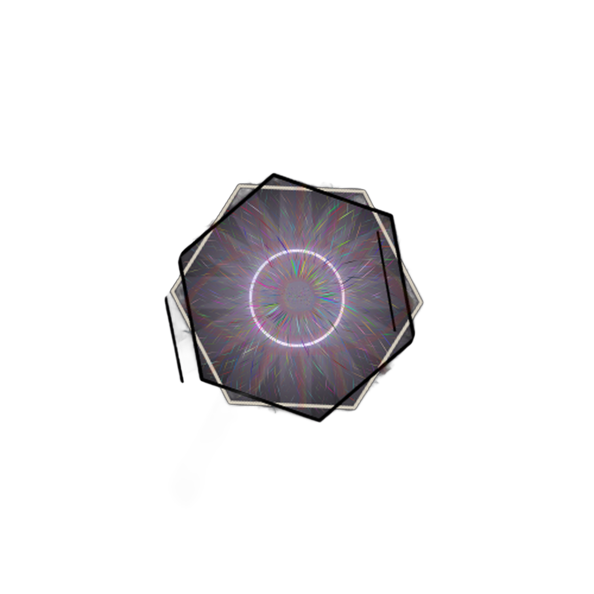

# Automated Background Remover (Computer Vision Pipeline)

An AI-powered computer vision utility developed in Python to automatically upscale images and remove complex backgrounds from logos, badges, and structural geometric shapes with high-precision edge retention. This project leverages `rembg` (utilizing the U-2-Net and IS-Net architectures) and `Pillow` to isolate central objects from dark or gradient environments.

---

## 🖼️ Visual Preview (Before & After)

| Raw Input (`ax_input`) | Processed Output (`ax_utput`) |
| :---: | :---: |
|  |  |

---

## 🛠️ Requirements & Installation

Before running the execution script, ensure you have Python 3.10+ initialized in your environment and install the required processing dependencies:

```bash
pip install rembg pillow
pip install "rembg[cpu]"